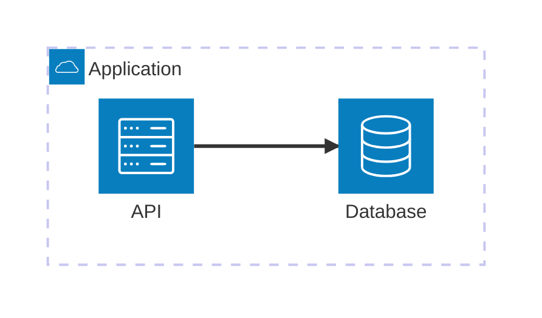

# Architecture examples

```mermaid
architecture-beta
    group app(cloud)[Application]
    service api(server)[API] in app
    service db(database)[Database] in app
    api:R --> L:db
```

Common patterns:
- `group app(cloud)[Application]`
- `service api(server)[API] in app`
- `api:R --> L:db`
