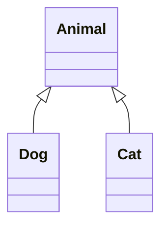
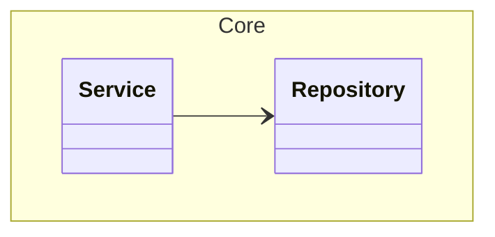

# Class diagram examples

```mermaid
classDiagram
    class Animal
    class Dog
    class Cat
    Animal <|-- Dog
    Animal <|-- Cat
```

Namespace example:

```mermaid
classDiagram
    namespace Core {
        class Service
        class Repository
    }
    Service --> Repository
```
