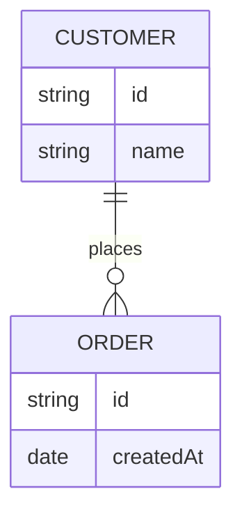

# ER diagram examples

```mermaid
erDiagram
    CUSTOMER ||--o{ ORDER : places
    CUSTOMER {
        string id
        string name
    }
    ORDER {
        string id
        date createdAt
    }
```

Common relationship shapes:
- `||--o{` one to many
- `}o--||` many to one
- `o{--o{` many to many
