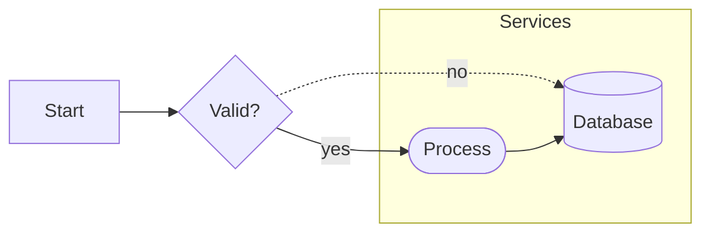

# Flowchart examples

Common patterns:
- `A[Label]` rectangle
- `A([Label])` rounded node
- `A((Label))` circle
- `A{Label}` decision/diamond
- `A[(Label)]` database
- `A --> B` solid edge
- `A -.-> B` dotted edge
- `A -->|label| B` labeled edge
