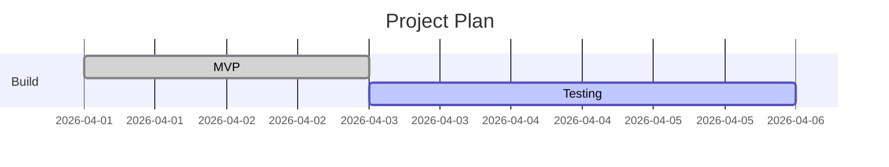

# Gantt examples

```mermaid
gantt
    title Project Plan
    dateFormat YYYY-MM-DD
    section Build
    MVP :done, a1, 2026-04-01, 2d
    Testing :active, a2, 2026-04-03, 3d
```

Common directives:
- `title Project Plan`
- `dateFormat YYYY-MM-DD`
- `section Build`
- `Task :active, id, 2026-04-03, 3d`
- `excludes weekends`
