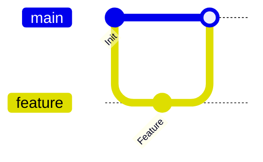

# gitGraph examples

```mermaid
gitGraph
    commit id:"Init"
    branch feature
    checkout feature
    commit id:"Feature"
    checkout main
    merge feature
```

Common commands:
- `commit id:"Init"`
- `branch feature`
- `checkout feature`
- `merge feature`
- `cherry-pick id:"abc123"`
