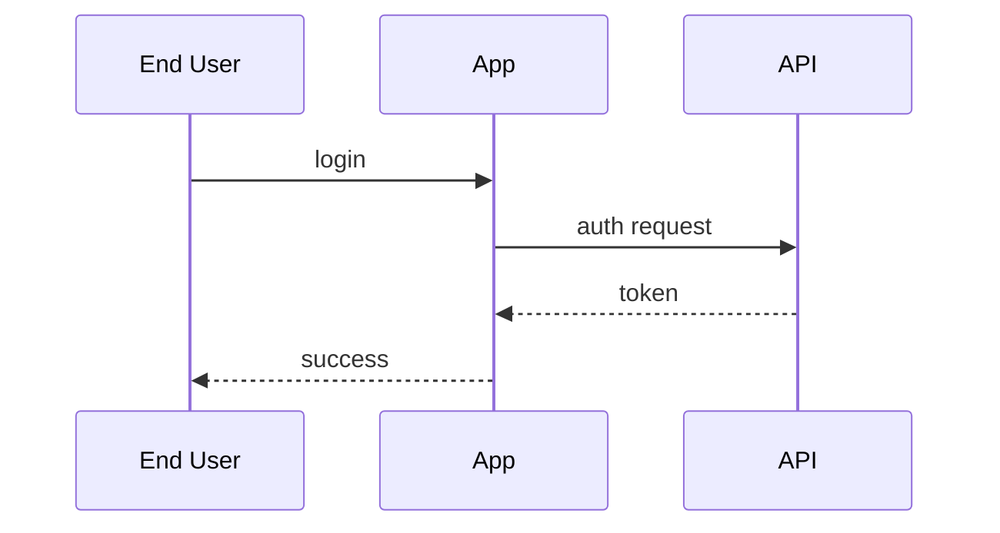
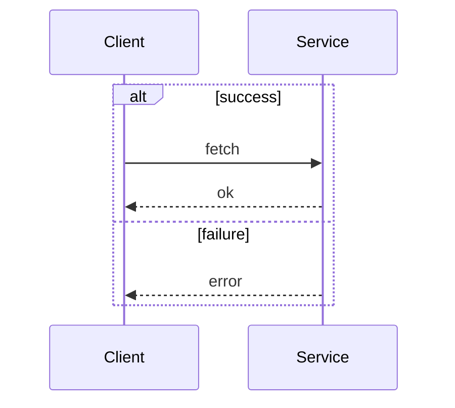

# Sequence diagram examples

```mermaid
sequenceDiagram
    participant User as End User
    participant App
    participant API
    User->>App: login
    App->>API: auth request
    API-->>App: token
    App-->>User: success
```

Block example:

```mermaid
sequenceDiagram
    participant Client
    participant Service
    alt success
        Client->>Service: fetch
        Service-->>Client: ok
    else failure
        Service-->>Client: error
    end
```
