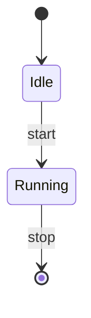
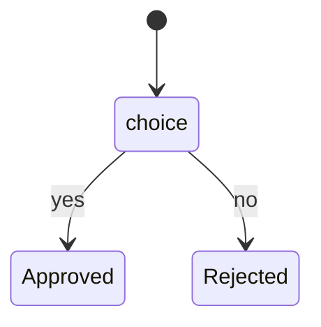

# State diagram examples

```mermaid
stateDiagram-v2
    [*] --> Idle
    Idle --> Running: start
    Running --> [*]: stop
```

Choice example:

```mermaid
stateDiagram-v2
    [*] --> choice
    state choice <<choice>>
    choice --> Approved: yes
    choice --> Rejected: no
```
